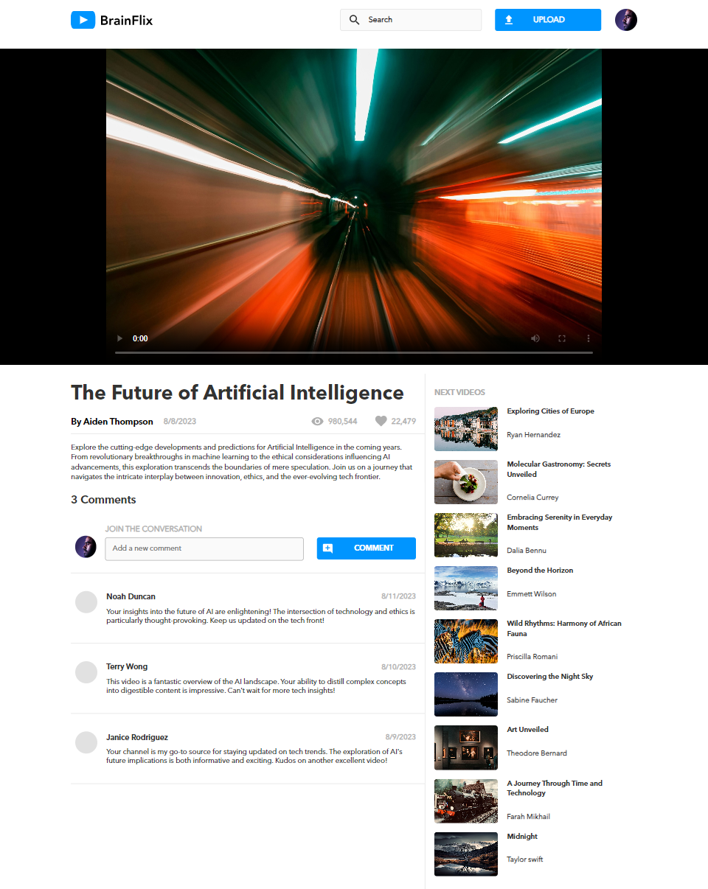
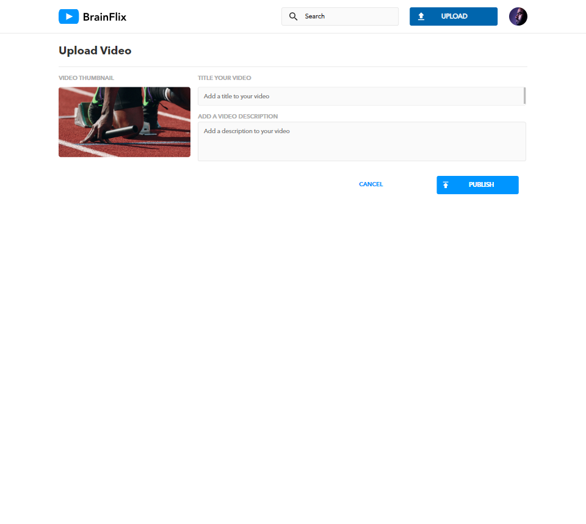

# BrainFlix Website


## Project Overview

BrainFlix is a fully responsive, multi-page video streaming platform prototype created using ReactJS, SASS, and Node.js. The project simulates a video streaming experience, allowing users to view videos, see related content, and upload new videos.

This project was built in three development sprints, progressively adding functionality such as routing, dynamic data fetching, and full API integration.

## Table of Contents

- [Features](#features)
- [Installation](#installation)
- [Technologies Used](#technologies-used)
- [Additional Notes](#additional-notes)
- [Screenshots](#screenshots)

## Features

### Sprint 1: Front-End Prototype
- Basic layout following the provided design package.
- Implemented with React functional components and SASS for styling.
- Responsive design for mobile, tablet, and desktop.
- Created a static homepage displaying a video player and a "Next Video" sidebar.
- The Next Video sidebar excludes the current video.
- Video details and comments are rendered dynamically using data from a JSON file.

### Sprint 2: API Integration & Multi-page Functionality
- Connected the application to a mock API using **axios** for dynamic video data.
- Added routing using **react-router-dom** for multi-page functionality:
  - **Home Page**: Displays a video player with a list of related videos.
  - **Video Details Page**: Shows selected video details and comments.
  - **Upload Page**: Allows users to add new videos.
- Side videos are clickable, and the main video updates dynamically using useParams and useEffect hooks.
- Implemented the "Upload" form, which redirects users to the homepage upon submission.

### Sprint 3: Custom API
- Developed a custom **Node.js/Express** API to handle video data.
- Endpoints:
  - `GET /videos`: Fetches a list of all videos.
  - `GET /videos/:id`: Fetches details of a single video.
  - `POST /videos`: Adds a new video.
- Video data is saved to a JSON file, persisting across sessions.
- Video uploads are handled via a form and the data is sent to the custom API for storage.
- Served static assets (video thumbnails) through Node.js.


## Installation

This project is split into two separate repositories: one for the client-side application and another for the server-side API. Follow the instructions below to set up both.


### Client Setup:

1. Clone the repository:
    ```bash
    git clone https://github.com/Dharati-Patel/Band-Site.git
    ```

2. Install the dependencies:
    ```bash
    npm install
    ```

3. Run the client development server:
    ```bash
    npm run dev
    ```

### Server Setup:

1. Clone the API repository:
    ```bash
    git clone https://github.com/Dharati-Patel/dharati-patel-brainflix-api.git
    ```

2. Install the server dependencies:
    ```bash
    npm install
    ```

3. Start the server:
    ```bash
    node index.js
    ```

## Technologies Used

- **React.js**: Front-end framework.
- **SASS (SCSS)**: For component-based styling.
- **Node.js**: Back-end server for the custom API.
- **Express.js**: Framework for handling API routes.
- **Axios**: To make API requests.
- **react-router-dom**: For client-side routing.
- **Vite**: For bundling and serving the React app.
- **Postman**: For API testing and debugging.
- **JSON**: For data persistence

## Additional Notes

Make sure both the client and server are running for the application to function properly. You can run them in parallel by opening two terminal windows or using a tool like [concurrently](https://www.npmjs.com/package/concurrently).

For more information, refer to the respective repositories:
- [Client-side documentation](https://github.com/Dharati-Patel/Band-Site.git)
- [Server-side documentation](https://github.com/Dharati-Patel/dharati-patel-brainflix-api.git)


## Screenshots

- **Home Page**

    

- **Upload Page**

    
